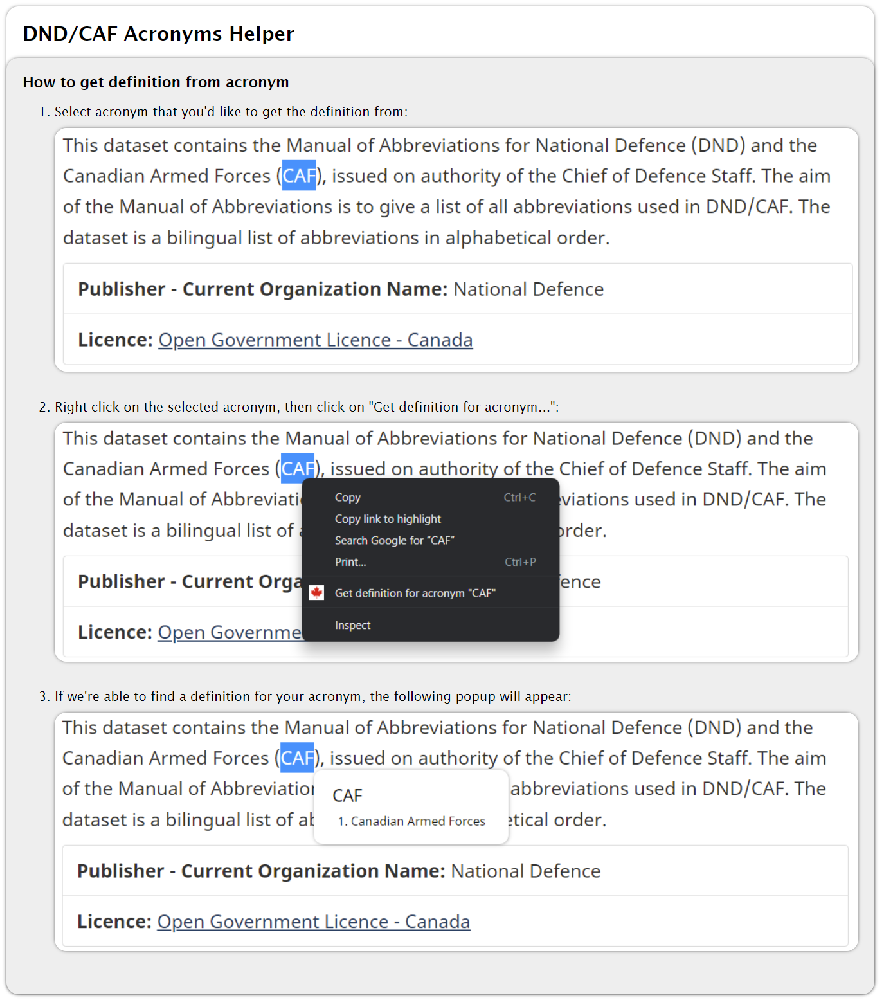

# DND-Hackathon-2022

## Description
We created a Google Chrome extension that helps with DND/CAF related acronyms in both English and French. This will be especially useful for new individuals who are not yet familiar with the wide variety of acronyms utilized through different government documents found on the web. Although, it will also come in handy for more experienced users browsing through unfamiliar documents.

---

## Usage
[Help Page](https://htmlpreview.github.io/?https://github.com/adrianong1/DND-Hackathon-2022/blob/main/src/html/help.html)



---

## Dataset
We utilized the [National Defence and the Canadian Armed Forces Manual of Abbreviations](https://open.canada.ca/data/en/dataset/976bb4f8-2b63-4150-910c-1f8e094cc83a) dataset to get a mapping from acronyms to their full terms.

---

## Getting Started Locally

### Setting up the Extension
1. Open the Google Chrome application, then click on the extensions button on the top right of your window (it looks like a puzzle icon), then click on <i>Manage Extensions</i>. Alternatively, you can copy and paste `chrome://extensions/` onto your address bar.
2. Once the Google Chrome's extension page has opened, click on the <i>Load unpacked</i> button on the top left of your window.
3. After the file explorer appears, go to your directory `path/to/repository/DND-Hackathon-2022/src/`, then click the <i>Select Folder</i> button.
4. The extension should now appear alongside your other extensions!

### (Optional) Updating the Dataset
1. If the [dataset](https://open.canada.ca/data/en/dataset/976bb4f8-2b63-4150-910c-1f8e094cc83a) is updated and you'd like to use the updated version, download the one that is listed by abbreviations to terms - as of right now, this is named <i>Alphabetical listing by abbreviation</i>. This should download an excel file called `manabvndataset-abvn.xlsx`. You'd need to rename it for the cleaning script to work otherwise.
2. Once you've downloaded the dataset, install the dependencies needed to run the cleaning script from the `requirements.txt` file - you may want to utilize a [Python virtual environment](https://docs.python.org/3/library/venv.html) for this:
```
pip install -r data/requirements.txt
```
3. Then, run the cleaning script to clean and transform the Excel file to a CSV file:
```
python data/clean_dnd_data.py
```
4. Finally, run the final Python script to create a JavaScript dictionary using the generated cleaned CSV files:
```
python data/create_acronyms_dict.py
```

----
